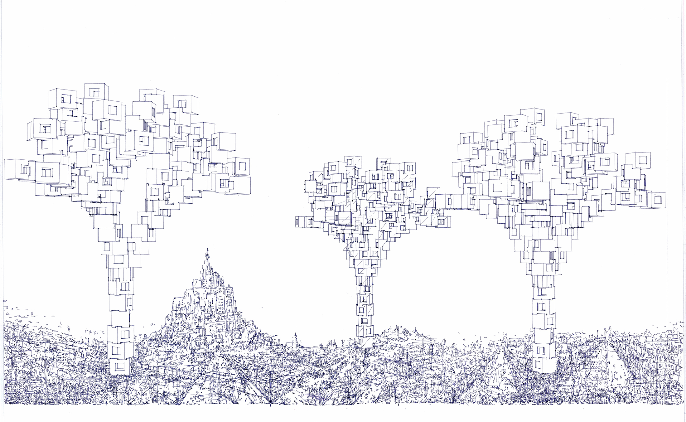
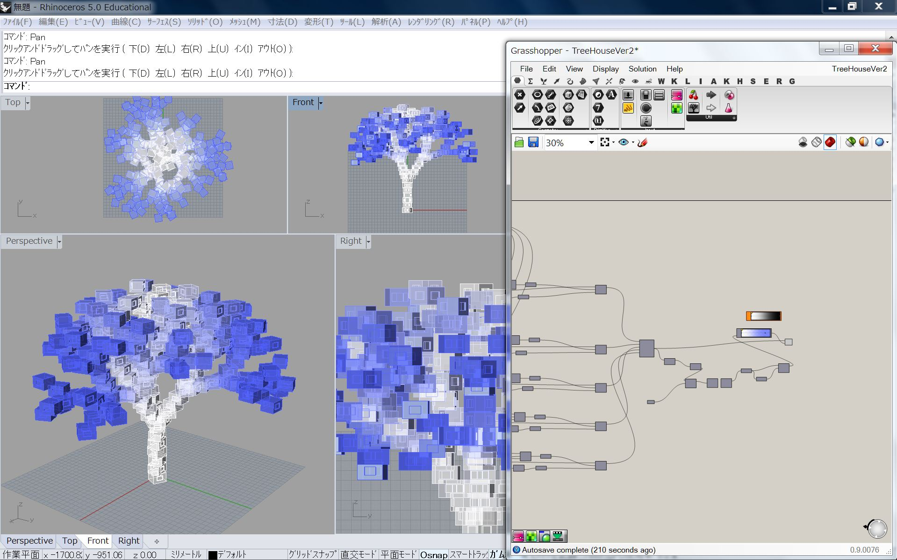

# Digital_Analog_Drawing  

  

ボールペンの質感と、  
コンピュータ的なデータの精密さと、  
Photoshop のトレースツールの変な省略と、  
高速で動くマシンのブレと、  
そして最後は手でゴリゴリ書き込んで、それらが色々相まってすごくいい感じに仕上がった。  

燃えるドローイング課題、2016.1  

A3 ケント紙  
無印0.28mmボールペン  
CraftROBO  

背景用画像加工 3h, モデリング 3h, プロッティング 3h, 手で書き込み3h  

  

---  